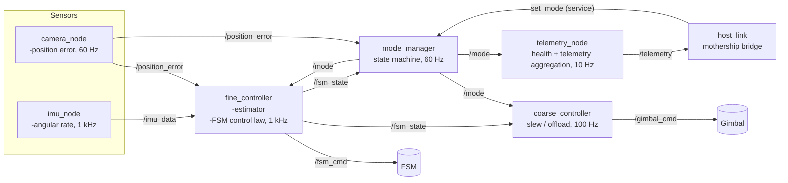

# PAT Terminal Design Document

This repo models the on-board software for a laser communications Pointing, Acquisition and Tracking (PAT)
terminal. The terminal has to acquire a counterpart terminal, lock onto it, and hold a tight pointing lock while both platforms move and vibrate.

### Deployment
This repo ships a Dockerfile. Uses ROS2 Humble.

### Glossary
- **Spot** is the beacon's image on the detector.
- **Position error** is the spot's offset from the detector center.
- **Handoff** is the transfer of pointing authority from the coarse loop to the fine loop.
#### Sensors and Actuators
- ***Camera** sees the spot and gives a position error.
- **IMU** is the Inertial Moment Unit. It provides angular rate and attitude data.
- **Gimbal** is the hardware in control of the coarse loop.
- **FSM** is the Fast Steering Mirror. It is the hardware in control of the fine loop. Not to be confused with "finite state machines".

## Part A: System Architecture
### A.1: Assumed Hardware Numbers
| Device | Assumed characteristics |
|---|---|
| Camera / detector | 60 fps, ~30 ms total latency |
| IMU | 1 kHz angular rate, < 1 ms latency |
| Gimbal | max rate ~20°/s, closed-loop bandwidth ~5 Hz |
| FSM | ±1 mrad optical range, ~1 kHz-class bandwidth, commanded at 1 kHz |

### A.2 Node architecture

#### camera_node
- Frame capture
- Computation of spot centroid
- Handles a validity check (no spot / saturated / on edge).
- Publishes position error in angular units, stamped with exposure time
- **Consideration**: exposure time should be used over publish time for accuracy's sake

#### imu_node
- IMU driver
- Handles calibration transformations
- Publishes calibrated angular rates and attitude at 1 kHz
- **Consideration**: There should not be any filters here. It is the estimator's job to calculate the beam's pointing error at any given time stamp, which is fused from the IMU + camera data.

#### estimator
- Answers one question: where is the beam pointing right now?
- Complementary filter: propagates the error estimate from IMU rates every 1 ms, then
  nudges it toward each camera measurement with a low-gain correction as frames arrive
- The two sensors fail in opposite frequency bands (IMU drifts at DC, camera cannot see
  vibration); this is the minimal fusion that exploits that
- A missing or invalid camera frame means no correction that cycle — the estimate
  coasts on IMU propagation, which is the same mechanism COAST relies on
- O(1) fixed-cost arithmetic per cycle, no allocations — fit for the 1 kHz path
- **Consideration**: this is a component inside fine_controller, not a node of its
  own — the estimate feeds the control law at 1 kHz and must not cross a process
  boundary (see A.5)
  
#### fine_controller
- Owns the FSM
- Owns the pointing-error estimate
- Publishes its own deflection state for the offload loop and for mode supervision

#### coarse_controller
- Owns the gimbal
- Slews to the commanded bearing
- Offload
  
#### mode_manager
  - Owns the state machine and is the single writer of `mode`
  - Exposes `set_mode` for the host to command
  - **Consideration**: `set_mode` is a service because the host must know if the command is accepted or rejected.
  - **Consideration** `mode` is distributed as a topic, not many per-node services. It is state that many nodes need, including ones that weren't alive when it changed (reliable + transient-local delivers the current mode to late joiners). Instead, mode_manager supervises behavior (`fsm_state`, `position_error`), and every controller holds a safe default until told otherwise.

#### telemetry_node
- Aggregates mode, health heartbeats, and key signals into a low-rate telemetry stream for the host. 
- Completely downstream of control path

#### host_link
- Abstracts the mothership interface.
- Handles communication protocols

### A.3 Control Hierarchy

### A.4 Timing and latency budget

### A.5 ROS2 middleware choices

### A.6 Failure Handling

## Part B: The hardest part

## Part D: Design Considerations
