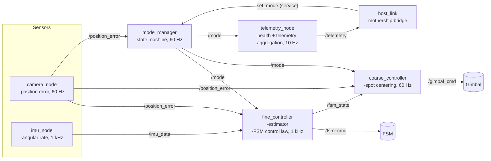
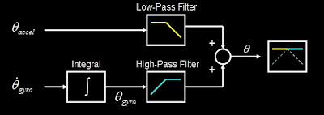
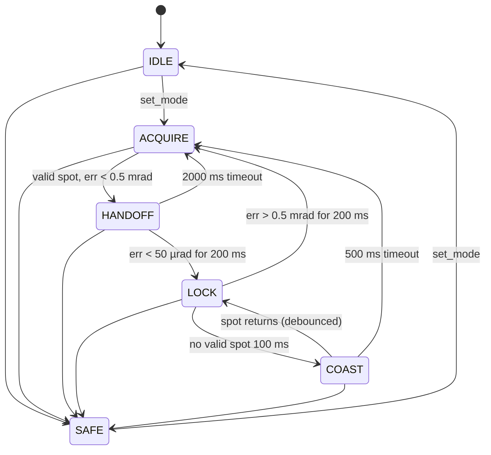
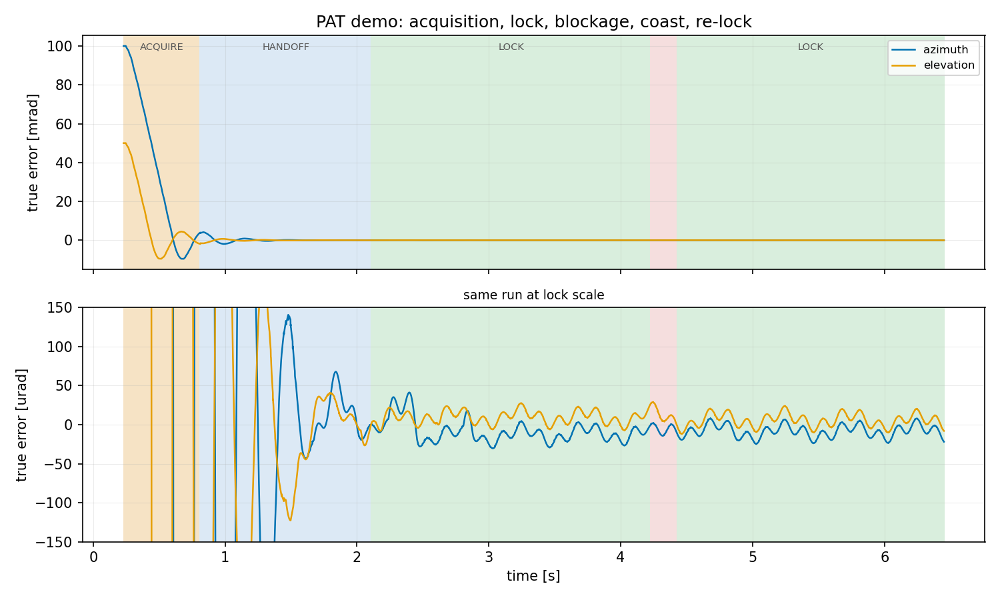

# PAT Terminal Design Document

This repo models the on-board software for a laser communications Pointing, Acquisition and Tracking (PAT)
terminal. The terminal has to acquire a counterpart terminal, lock onto it, and hold a tight pointing lock while both platforms move and vibrate.

### Deployment
This repo ships a Dockerfile. Uses ROS2 Humble.

### Glossary
- **Spot** is the beacon's image on the detector.
- **Position error** is the spot's offset from the detector center.
- **Handoff** is the transfer of pointing authority from the coarse loop to the fine loop.
- **Mode** is the terminal's operating regime (IDLE, ACQUIRE, HANDOFF, LOCK, COAST, SAFE). Modes are the states of mode_manager's state machine, and thus the overall state of the PAT terminal. Elsewhere, "state" (as in `fsm_state`) means an actuator's physical state. Note thate modes are always written in CAPS LOCK.
#### Sensors and Actuators
- ***Camera** sees the spot and gives a position error.
- **IMU** is the Inertial Moment Unit. It provides angular rate and attitude data.
- **Gimbal** is the hardware in control of the coarse loop.
- **FSM** is the Fast Steering Mirror. It is the hardware in control of the fine loop. Not to be confused with "finite state machines".

## Part A: System Architecture
### A.1: Assumed Hardware Numbers
| Device | Assumed characteristics |
|---|---|
| Camera / detector | 60 fps, ~30 ms total latency |
| IMU | 1 kHz angular rate, < 1 ms latency |
| Gimbal | max rate ~20°/s, closed-loop bandwidth ~5 Hz |
| FSM | ±1 mrad optical range, ~1 kHz-class bandwidth, commanded at 1 kHz |

> [!NOTE]
> **Assumption**: These are assumed numbers from the description of the design challenge. All of them are parameters in the implementation.

### A.2 Node architecture

#### camera_node
- Frame capture
- Computation of spot centroid
- Handles a validity check (no spot / saturated / on edge).
- Publishes position error in angular units, stamped with exposure time

> [!NOTE]
> exposure time should be used over publish time for accuracy's sake

> [!NOTE]
> **Assumption**: The two axes (azimuth/elevation) are decoupled and the camera is calibrated, so it reports angular error directly in the FSM's axes. On top of that, there's no rolling shutter artifacts, motion blur, nor distortion.

#### imu_node
- IMU driver
- Handles calibration transformations
- Publishes calibrated angular rates and attitude at 1 kHz

> [!NOTE]
> There should not be any filters here. It is the estimator's job to calculate the beam's pointing error at any given time stamp, which is fused from the IMU + camera data.

#### fine_controller
- Owns the FSM
- Owns the pointing-error estimate
- Publishes its own deflection state for the offload loop and for mode supervision

- Estimator that outputs where is the beam pointing right now
  - Complementary filter ([reference](https://www.olliw.eu/2013/imu-data-fusing/)): $\theta_k = \alpha (\theta_{k-1} + \omega_k \Delta t) + (1-\alpha) a_k$, where $\theta$ is the estimated position error, $\omega_k$ the IMU rate and $a_k$ the camera measurement.
  - Each cycle is a weighted average of two opinions: the IMU-propagated prediction with weight α ≈ 0.95, and the camera measurement with weight 1−α. The blend only runs on cycles where a fresh valid frame arrived (60 Hz); propagation runs every 1 ms.
  - The two sensors fail in opposite frequency bands. There is IMU drift, and the camera cannot see vibration. this is the minimal fusion that exploits that
  - A missing or invalid camera frame is simply α = 1 for that cycle, meaning the estimate coasts on IMU propagation.
  - O(1) fixed-cost arithmetic per cycle. fit for the high frequency 1 kHz path

*The same filter seen in the frequency domain, diagram from [Shane Colton's blog](https://scolton.blogspot.com/2012/09/fun-with-complementary-filter-multiwii.html). The absolute sensor is low-passed and the integrated rate sensor is high-passed, and the two paths sum to 1. Here the camera replaces θ_accel and the IMU replaces θ_gyro.*

> [!NOTE]
> **Alternative considered**: a latency-compensated estimator could be implemented instead by buffering IMU history and applying each camera correction at its measurement time. It is not needed at these numbers. With a small camera weight (1−α ≈ 0.05 per frame at 60 fps) the camera branch only has authority below f_c ≈ (1−α)·60/2π ≈ 0.5 Hz. Everything faster is corrected by the IMU at < 1 ms latency. Applying a 0.5 Hz signal 30 ms late gives a phase error of 2π·0.5·0.03 ≈ 0.1 rad, so the correction mis-aims by ~10% of the sub-Hz residual (~10 µrad in LOCK). I assume this is acceptable in this context.

- PI control law that turns the estimated error into the FSM deflection command, per axis
  - The command is clamped to a value tighter than the maximum hardware limit, and the integrator is clamped to the same limit, so a long saturation episode does not overshoot on recovery

> [!NOTE]
> **Alternative considered**: full PID control law. The derivative term is dropped because I assume that the vibrations will cause a high amount of noise measured by the IMU.

> [!NOTE]
> **Alternative considered**: P-only control law. Simpler, but I expect constant disturbance (bias wind, platform tilt, IMU drift). Thus, there will still be significant error in a steady-state. The integrator accumulates until it cancels the bias, which is what holds the spot centered.

> [!NOTE]
> **Alternative considered**: a naive integrator with no anti-windup ([reference](https://en.wikipedia.org/wiki/Integral_windup)). During HANDOFF entry the error is large and the command saturates at the FSM range, but the integrator keeps accumulating error it cannot act on. When the error finally collapses, that stored integral pushes the command hard the other way, and the overshoot can break the lock that was just acquired. To prevent this, I decided to clamped the itegral contribution to the output limit.

#### coarse_controller
- Owns the gimbal
- In ACQUIRE and HANDOFF, steers the gimbal to center the spot using the camera position error
- Steering has a deadband (0.1 mrad): below it the gimbal holds and the residual belongs to the FSM alone. This is to prevent unnecessary gimbal oscillation during a lock.
- In LOCK, offloads the FSM's average deflection instead (τ ≈ 5 s low-pass), so the FSM re-centers
  
#### mode_manager
  - Owns the state machine and is the single writer of `mode`
  - Exposes `set_mode` for the host to command
  - Modes:
    - **IDLE**: powered and healthy, doing nothing. FSM centered, gimbal halted
    - **ACQUIRE**: coarse control only owns position error. gimbal steers to center the spot using the camera, until the error is within the FSM's authority
    - **HANDOFF**: fine loop closes on the spot while the gimbal keeps centering it. Exits to LOCK on debounced low error, aborts back to ACQUIRE on timeout
    - **LOCK**: fine control only owns position error. Falls back to ACQUIRE if the error sustains beyond the FSM's authority, since only camera-steered acquisition can recover that quickly
    - **COAST**: camera can't find the spot. Use IMU to keep still, then re-enter LOCK or fall back to ACQUIRE
    - **SAFE**: FSM centered, gimbal halted, waiting for the host. reachable from every state

> [!NOTE]
> `set_mode` is a service because the host must know if the command is accepted or rejected.

> [!NOTE]
> `/mode` is distributed as a topic, not many per-node services. It is state that many nodes need, including ones that weren't alive when it changed (reliable + transient-local delivers the current mode to late joiners). Instead, mode_manager supervises behavior (`position_error`), and every controller holds a safe default until told otherwise.

#### telemetry_node
- Aggregates mode, health heartbeats, and key signals into a low-rate telemetry stream for the host. 
- Completely downstream of control path

#### host_link
- Abstracts the mothership interface.
- Handles communication protocols

> [!NOTE]
> **Assumption**: The host is abstracted to the `set_mode` service and the telemetry topics. Everything else behind host_link is out of scope.

### A.3 Control Hierarchy

Two loops share one job:

- **Coarse loop** (camera → coarse_controller → gimbal): wide range, ~5 Hz bandwidth. Points and acquires.
- **Fine loop** (IMU + camera → estimator → FSM): ±1 mrad range, 1 kHz. Holds lock and rejects vibration.

> [!NOTE]
> **Assumption**: The counterpart's beacon is always on. There's no atmospheric model, and all disturbance is platform-side: vibration plus slow relative drift.

**Acquisition.** The gimbal steers to center the spot using the camera's position error. There is no external bearing input: the camera is the only source of target direction, and the detector center is the target by optical construction. mode_manager commands HANDOFF once the spot is valid and the error is within the FSM's authority (< 0.5 mrad, half the FSM range).

> [!NOTE]
> **Assumption**: The camera field of view is infinite, so the spot is always on the detector and the camera always has a direction to steer by. A real detector edge would create a blind regime where the terminal has no information to steer by, needing a search scan.

**Handoff.** The fine loop closes on the estimated error while the gimbal keeps centering the spot at its own slow bandwidth. HANDOFF exits to LOCK when the error stays below 50 µrad for 200 ms. If that isn't met within 2000 ms, HANDOFF aborts back to ACQUIRE. Handoff is a real state with entry, exit, and abort criteria because the transient where the FSM first grabs the beam is where the failures live.

> [!NOTE]
> The handoff entry threshold exists because a visible spot is not yet a reachable spot: the camera sees far beyond the ±1 mrad the FSM can reach. Handing off earlier saturates the FSM and strands the residual error where neither loop is finishing the job.

**Lock and offload.** In LOCK the FSM owns the position error entirely. The gimbal ignores the camera and tracks a low-passed version (τ ≈ 5 s) of the FSM's deflection: it steers toward wherever the FSM is straining, and the FSM re-centers itself. Saturation is managed continuously instead of as an event.

> [!NOTE]
> The offload is deliberately slow. The estimator cannot see gimbal motion (the IMU is on the platform, and the fine loop only compensates its own FSM commands), so the camera corrections must keep re-teaching the estimator while the gimbal walks. The offload error is roughly deflection × correction lag / τ, and τ ≈ 5 s keeps it below the vibration ripple. The offload only needs to outpace the 2 µrad/s drift, which it does by orders of magnitude.

> [!NOTE]
> **Alternative considered**: Both loops consuming camera error simultaneously will fight unless carefully frequency-separated. Making the gimbal jump when the FSM nears its limit can turn FSM saturation into a sudden jolt that can break the lock, which may work, but requires a lot of tuning. With offload, one error signal has only one owner at a time, and the gimbal will move smoothly instead of jumping.

#### Loss of lock
When the camera stops reporting a valid spot, the response is tiered:

1. **COAST**: hold on IMU dead-reckoning for up to 500 ms. Brief dropouts usually self-heal, and re-acquiring over a one-frame gap would cost seconds of link.
2. If the spot returns, re-enter LOCK through the same debounce as HANDOFF.
3. Otherwise fall back to ACQUIRE. The gimbal already points at the last known spot location and waits for the spot to reappear.

A lock can also be lost with the spot still visible: if the error sustains beyond the FSM's authority (> 0.5 mrad for 200 ms), LOCK falls back to ACQUIRE directly. In LOCK the gimbal only moves at the offload's gentle pace, so a large jump of the counterpart would otherwise take tens of seconds to walk down. Camera-steered ACQUIRE recovers it in well under a second.

### A.4 Timing and latency budget

| Path | Rate | Latency | Hard real-time? |
|---|---|---|---|
| IMU → estimator → FSM command | 1 kHz | < 1 ms sensor to actuator | yes, the only one |
| camera → estimator correction | 60 Hz | 30 ms | no |
| camera → mode_manager supervision | 60 Hz | 30 ms | no |
| camera steering / offload → gimbal | 60 Hz / 100 Hz | tens of ms | no |

The only hard real-time path is the 1 kHz fine loop. Each cycle must finish within its 1 ms budget. The estimator and PI arithmetic are O(1), so the budget is spent on executor wakeup jitter, not computation.

The slow camera path cannot contaminate the fast path by construction: the camera only enters the fine loop through the correction term with weight 1−α = 0.05, so a late, missing or invalid frame changes ver little about the 1 kHz cycle.

### A.5 ROS2 middleware choices
#### QoS Profiles

| Topic / service | Reliability | Durability | History | Reason |
|---|---|---|---|---|
| `/imu_data` | best effort | volatile | keep last 1 | The most recent sensor data is the most important |
| `/position_error` | best effort | volatile | keep last 1 | The most recent sensor data is the most important. validity flag + stamp let downstream nodes reason about gaps |
| `/fsm_cmd`, `/gimbal_cmd` | best effort | volatile | keep last 1 | Only the last command matters |
| `/fsm_state`, `/gimbal_state` | best effort | volatile | keep last 1 | Only the last command matters |
| `/mode` | reliable | transient local | keep last 1 | A late-joining node must immediately learn the current mode. Missing a mode change is not acceptable |
| `/telemetry`, `/health` | reliable | volatile | keep last 10 | This data is not time-critical. Robustness of logging is more important |
| `/set_mode` (service) | reliable (service default) | — | — | Host needs to know if their command was accepted or rejected |

#### Executors and callback groups
The fine_controller process is where starvation would hurt, so it is structured explicitly:

- A **real-time callback group** (mutually exclusive):
  - 1 kHz control timer
  - IMU subscription.
  - single-threaded executor on a dedicated thread.
- A **housekeeping group** for everything else (default group):
  - camera correction
  - mode subscription
  - state publishing
  - parameter callbacks
  - etc.
  
> [!NOTE]
> ROS2 executors have no priority setting. Under load, using a multithreaded executor with everything in the same callback group may cause lower priority tasks like parameter callbacks to delay the control loop.

> [!NOTE]
> The real-time callback group is mutually exclusive because it guarantees that the timer + IMU callbacks never overlap, so they can share the estimator state without having to manually handle a mutex. The housekeeping group doesn't really matter because it is not time-critical.

#### Discovery and late join
DDS discovery means nodes can start in any order and links form whenever both ends exist.
- `/mode` is transient-local, so any node that starts late (or restarts) receives
  the current mode immediately on subscription match.
- Until a first mode message arrives, every controller behaves as in SAFE: the fine controller centers the FSM and the coarse controller holds the gimbal. A controller that boots mid-LOCK therefore does nothing until told otherwise.
- Service clients use `wait_for_service` with timeout rather than assuming the server exists.

> [!NOTE]
> ROS2 lifecycle nodes with launch orchestration were considered: bring every node to `active` before any mode leaves IDLE, and no one joins late. However, that only solves the startup case. A node that crashes and restarts mid-run, or a subscription that matches late in a DDS discovery race may still break the system. A transient-local `/mode` plus safe defaults covers startup as well as error recovery. Note that lifecycle nodes could still be added for orderly startup if it helps.

### A.6 Failure Handling
| Failure | Detection | Response |
|---|---|---|
| Lost camera frames | inter-frame watchdog | mode_manager enters COAST after 100 ms without a valid spot. The estimator dead-reckons on the IMU. After 500 ms without the spot returning, mode_manager falls back to ACQUIRE. |
| IMU invalid data | rate-of-change and range gating on each sample | Bad samples are dropped and the previous rate is held. IMU silence > 5 ms in LOCK means the spec is unmeetable, so mode_manager enters SAFE. |
| Mode transition safety | — | Entry actions run on every transition: ACQUIRE centers the FSM, SAFE centers the FSM and halts the gimbal. |
| Node crash / silence | stale-data watchdogs on control topics | Controllers fall back to safe defaults on stale inputs. mode_manager enters SAFE instead of acting on stale state. The node is relaunched (launch-file respawn), learns the current mode from transient-local `/mode`, and operation resumes. |

---

## Part B: The hardest part
Ranked hardest first:

1. **The coarse/fine handoff and its failure modes.** System integration is always hard.
1. **Fusing a delayed, slow measurement with a fast sensor.** The camera's 30 ms latency against a 1 kHz loop.
1. **Holding hard real-time in ROS 2.** Executor isolation, QoS discipline, RT kernel configuration. This requires careful programming and identifying chokepoints.

> [!NOTE]
> Items 2 and 3 are hard, but at the end of the day, they are one component with one job and clear success criteria. On top of that, there are known solutions for them, it just requires tuning.
> 
> The handoff is hard because it is an interaction between systems. The two controllers have opposite dynamics, a state machine, and imperfect sensing. Every part can be individually correct but the system still fails because of emergent properties. The failure modes are interaction failures. For example, the FSM could slamming into its range limit because the gimbal hadn't settled, offload and re-acquisition could fight over the gimbal, or a stale mode message could leave two controllers each believing they own the beam.

In order to build these, the following nodes are required:
1. plant_sim: simulation of sensors and actuators. not an actual part of the PAT terminal.
1. fine_controller: 1 kHz loop
1. coarse_controller: 60 Hz loop
1. mode_manager: overall state machine

> [!NOTE]
> **Assumption**: One terminal is modeled. The counterpart is a fixed, slowly drifting bearing in the sim.

> [!NOTE]
> **Alternative considered**: simulated-clock testing (`use_sim_time`) for deterministic, faster-than-real-time tests. However, I will just implement the tests running with the wall clock due to time constraints.

#### How plant_sim models the world
A single node owns the ground truth: the true pointing error per axis.

- For each axis, true error = counterpart bearing + disturbance − gimbal position − FSM deflection
- Both actuators share one model: a first-order lag toward the command, a slew-rate limit, and a range clamp
  - The gimbal is the slow one: τ ≈ 32 ms (from the 5 Hz closed-loop bandwidth), 20°/s rate limit, wide range
  - The FSM is the fast one: ~1 kHz-class τ, ±1 mrad range
- The camera samples the truth at 60 Hz, adds centroid noise, and stamps the message 30 ms in the past. The FOV is infinite, so the valid flag goes false only when a blockage is scripted
- The IMU publishes the true platform rate plus a slow bias at 1 kHz
- Blockage is scripted by the integration test (or `just blockage`) to drive the LOCK → COAST → re-lock story
- plant_sim plays the sensor and actuator drivers, so in the simulation it also publishes `/fsm_state` (the FSM's physical state) and exposes a sim-only `set_bearing` service to move the counterpart at runtime for manual testing purposes

> [!NOTE]
> The actuator model integrates with Euler's method at the 1 kHz sim tick, and the per-step fraction dt/τ is capped at 1. Without the cap, an actuator faster than the tick rate overshoots its command by dt/τ − 1 every step and diverges into banging between its range limits. The cap means such an actuator simply settles within the step, which is the physically correct limit behavior. I found this when the first closed-loop run drove the FSM to its range stop while commanding nearly zero, and the fix is pinned by a unit test.

> [!NOTE]
> **Assumptions**: 
> - actuator disturbance can be modelled by a slow bias drift plus 2 fixed sinusoids due to platform vibration
> - sensor noise is gaussian, the camera latency is a constant 30 ms, and no frames are dropped except during scripted blockage. The IMU has bias drift.
> - all angles are small and the axes are decoupled, so the contributions add linearly and each axis is simulated independently.
> - the actuators are first-order only. This is sufficient to reproduces the behaviors the design must handle: lag, slew saturation and range saturation.

---

### Part D: Next steps with more time or real hardware
1. Record data and model the real gimbal and FSM, then re-tune both loop parameters and the handoff thresholds against measured dynamics. I expect there to be some resonance and static friction with the real actuators, but that should be collected before being modelled in software. 
1. I assumed that the vibration noised are sinusoids. To make the simulation more accurate, the real vibration spectra should be measured so it can be modelled more accurately.
1. The code should be tested on real hardware. CPU and memory bottlenecks may be different on the actual PAT terminal computer, and these should be profiled.
1. I assumed the camera field of view is infinite. A real detector has an edge, and losing the spot past it leaves the terminal blind. That needs a search scan mode where the gimbal sweeps until the spot reappears, plus FOV-edge validity handling in camera_node.
1. Adding more IMU glitches to the test suite.

### Run instructions
1. install docker dependencies
1. build the docker image: `just build_docker`
1. run the docker: `just run_docker`
1. run the simulation: `just launch`
1. attach to the docker in another terminal: `just attach`
1. command PAT to ACQUIRE: `just set_mode 1`

### Results

This simulation run was recorded by `just plot`, which runs the integration test and records it, so the figure shows exactly the run the test suite asserts.

- **ACQUIRE**: the gimbal slews down 100 / 50 mrad of initial offset at its rate limit, steered by the camera alone
- **HANDOFF → LOCK**: once the error is within the FSM's authority, the fine loop closes and the lock debounce passes.
- **LOCK**: the FSM holds the true error within ~±20 µrad against the 2 Hz and 7 Hz platform vibration
- **COAST** (the narrow red band): a scripted blockage blinds the camera. The FSM keeps rejecting vibration on IMU dead-reckoning alone, and the error stays bounded until the spot returns.
